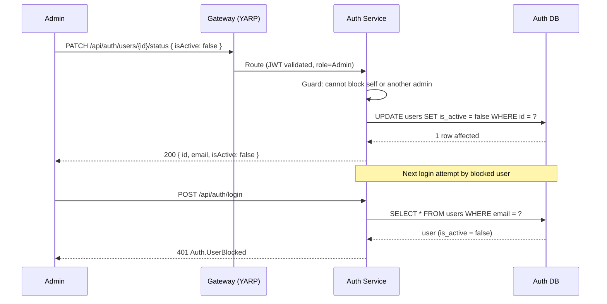
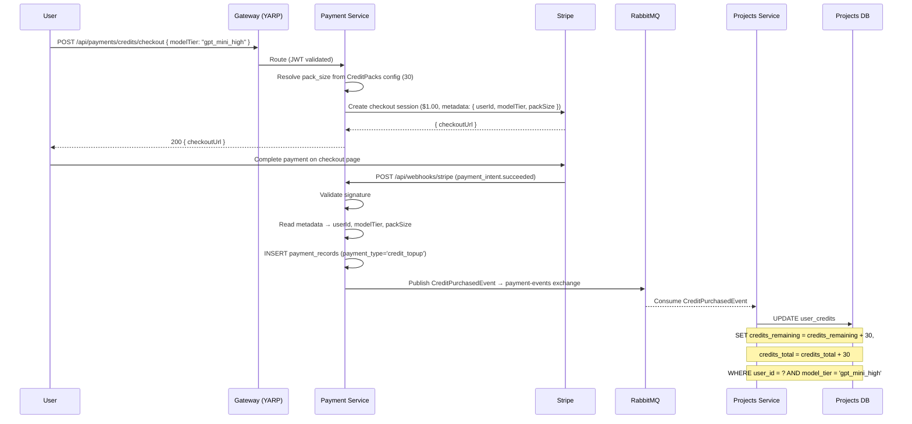
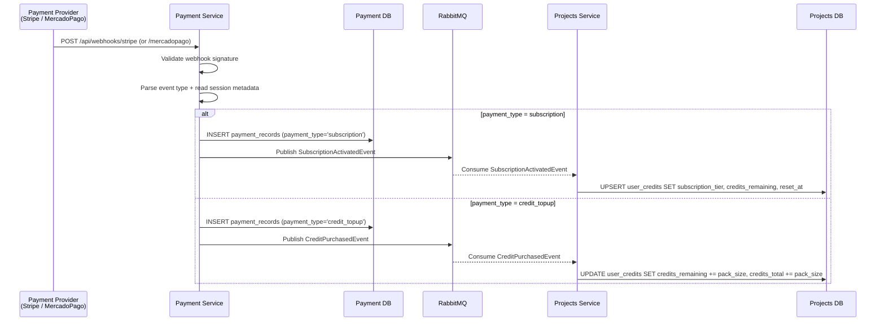
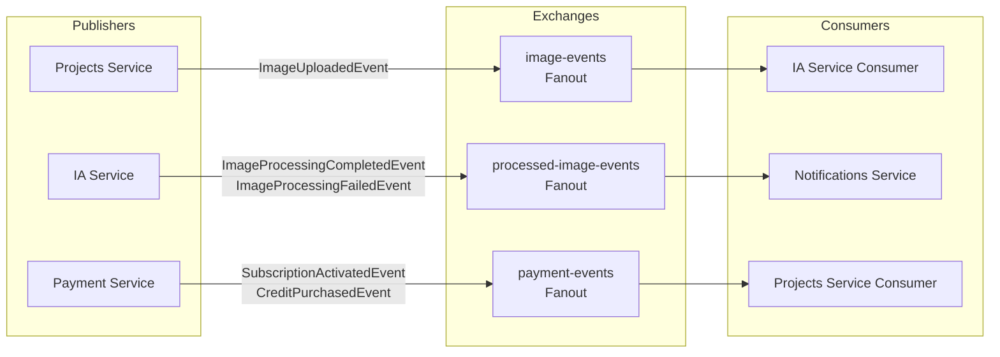
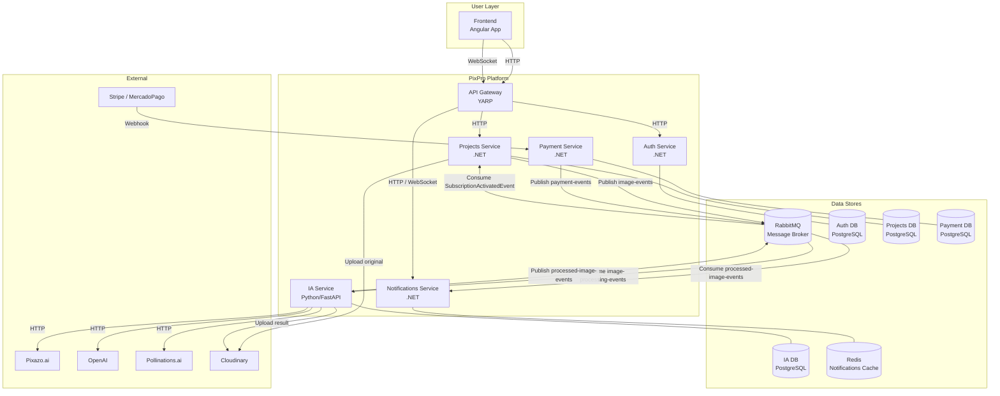
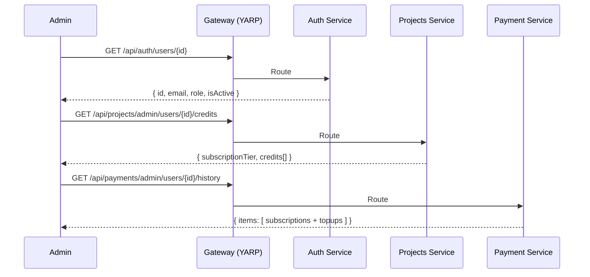
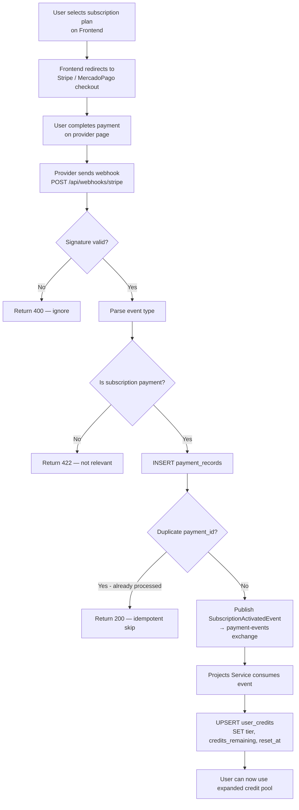

## **Admin Features & Payment Service Architecture**

---

## **1. Auth Service — Admin User Management**

### **New: `IsActive` field on `User` entity**

The `User` entity gains an `IsActive` flag to support blocking/unblocking users. A blocked user cannot log in and, if they have an active JWT, is rejected at the middleware level.

**Updated `User` entity (Auth Service — Domain layer):**

```csharp
public sealed class User
{
    public Guid Id { get; private set; }
    public string? Auth0Id { get; private set; }
    public string Email { get; private set; }
    public string Password { get; private set; }
    public UserRole Role { get; private set; }
    public bool IsActive { get; private set; }        // NEW
    public DateTimeOffset CreatedAt { get; private set; }

    public void Block()   => IsActive = false;        // NEW
    public void Unblock() => IsActive = true;         // NEW
}
```

**Default value:** `IsActive = true` on `User` constructor.

**DB migration required:**
```sql
ALTER TABLE users ADD COLUMN is_active BOOLEAN NOT NULL DEFAULT TRUE;
```

### **Block check in `LoginAsync`**

After verifying the password, before generating the JWT:

```
IF user.IsActive == false
    RETURN Error.Unauthorized("Auth.UserBlocked", "This account has been suspended.")
```

### **Block check in JWT middleware**

A blocked user with an existing valid JWT must be rejected. Options:

| Approach | Pros | Cons |
|----------|------|------|
| **DB check on every request** | Immediate effect | Extra DB query per request |
| **Short JWT expiry (e.g. 15 min)** | No extra query | Delay up to expiry window |
| **Token blacklist in Redis** | Immediate + no per-request DB query | Requires Redis + blacklist management |

**Recommended:** DB check on every request for now (simpler, Redis can be added later). Add a lightweight `GET /users/{id}/is-active` internal endpoint or a middleware that hits the Auth DB.

---

### **New Admin Endpoints — Auth Service**

#### `GET /api/auth/users` — List all users (paginated)

```
[Authorize(Policy = "Admin")]
GET /api/auth/users?page=1&pageSize=20&search={email}

Response 200:
{
  "items": [
    {
      "id": "uuid",
      "email": "user@example.com",
      "role": "User",
      "isActive": true,
      "createdAt": "2025-01-01T00:00:00Z"
    }
  ],
  "totalCount": 150,
  "page": 1,
  "pageSize": 20
}
```

#### `PATCH /api/auth/users/{id}/status` — Block or unblock a user

```
[Authorize(Policy = "Admin")]
PATCH /api/auth/users/{id}/status

Body:
{
  "isActive": false   // false = block, true = unblock
}

Response 200:
{
  "id": "uuid",
  "email": "user@example.com",
  "isActive": false,
  "updatedAt": "2025-06-04T00:00:00Z"
}
```

**Error codes:**
| Code | HTTP | Description |
|------|------|-------------|
| `Auth.UserNotFound` | 404 | User ID does not exist |
| `Auth.CannotBlockAdmin` | 400 | Admin cannot block another admin |
| `Auth.CannotBlockSelf` | 400 | Admin cannot block themselves |

---

### **Updated `IAuthService` interface**

```csharp
public interface IAuthService
{
    Task<Result<UserResponse>> RegisterUserAsync(RegisterUserRequest request, CancellationToken ct = default);
    Task<Result<UserResponse>> GetUserByEmailAsync(string email, CancellationToken ct = default);
    Task<Result<LoginResponse>> LoginAsync(LoginRequest request, CancellationToken ct = default);

    // NEW
    Task<Result<PagedResult<UserResponse>>> GetAllUsersAsync(int page, int pageSize, string? search, CancellationToken ct = default);
    Task<Result<UserResponse>> SetUserStatusAsync(Guid userId, bool isActive, Guid requestingAdminId, CancellationToken ct = default);
}
```

### **Block/Unblock Flow**



---

## **2. Projects Service — Admin Subscription Management**

Until the Payment Service is live, the admin can manually assign or change a user's subscription tier.

### **New Admin Endpoint — Projects Service**

#### `PATCH /api/projects/admin/users/{userId}/subscription` — Assign subscription manually

```
[Authorize(Policy = "Admin")]
PATCH /api/projects/admin/users/{userId}/subscription

Body:
{
  "subscriptionTier": "pro",
  "creditsLow": 100,
  "creditsKontext": 50,
  "creditsHigh": 10,
  "resetAt": "2025-07-04T00:00:00Z"   // null for unlimited tier
}

Response 200:
{
  "userId": "uuid",
  "subscriptionTier": "pro",
  "credits": {
    "gpt_mini_low": 100,
    "kontext": 50,
    "gpt_mini_high": 10
  },
  "resetAt": "2025-07-04T00:00:00Z"
}
```

#### `GET /api/projects/admin/users/{userId}/credits` — View user credit balance

```
[Authorize(Policy = "Admin")]
GET /api/projects/admin/users/{userId}/credits

Response 200:
{
  "userId": "uuid",
  "subscriptionTier": "free",
  "credits": [
    { "modelTier": "gpt_mini_low",  "remaining": 3, "total": 5 },
    { "modelTier": "kontext",       "remaining": 1, "total": 3 },
    { "modelTier": "gpt_mini_high", "remaining": 0, "total": 1 }
  ],
  "resetAt": null
}
```

---

## **3. Payment Service — Autonomous Microservice**

### **Overview**

The Payment Service is a fully autonomous microservice. It:
1. Receives webhooks from a payment provider (Stripe or MercadoPago)
2. Validates and records the payment
3. Publishes a `SubscriptionActivatedEvent` or `CreditPurchasedEvent` to RabbitMQ depending on payment type

The Projects Service consumes that event and activates the subscription with no human intervention. No service calls another directly — everything is event-driven.

### **Tech Stack**

| Concern | Choice |
|---------|--------|
| Language | .NET (consistent with Auth and Projects) |
| Framework | ASP.NET Core (webhook endpoint) |
| DB | PostgreSQL (payment records) |
| Messaging | RabbitMQ (publish `payment-events` exchange) |
| Provider | Stripe or MercadoPago (TBD) |

### **Project Structure**

```
src/Services/Payment/
├── API/
│   ├── Controllers/
│   │   └── WebhookController.cs       # Receives provider webhooks
│   └── Program.cs
├── Application/
│   ├── Services/
│   │   ├── Interfaces/
│   │   │   └── IPaymentService.cs
│   │   └── Implementations/
│   │       └── PaymentService.cs
│   └── DTOs/
│       ├── StripeWebhookPayload.cs
│       └── MercadoPagoWebhookPayload.cs
├── Domain/
│   ├── Entities/
│   │   └── PaymentRecord.cs
│   └── Enums/
│       ├── PaymentStatus.cs
│       └── SubscriptionTier.cs
├── Infrastructure/
│   ├── Database/
│   │   └── PaymentDbContext.cs
│   └── Messaging/
│       └── RabbitMQPublisher.cs
└── alembic/                           # or EF migrations
```

### **Database Table: `payment_records`**

```sql
payment_records
├── id                  UUID            PRIMARY KEY
├── user_id             UUID            NOT NULL
├── provider            VARCHAR(50)     NOT NULL   (stripe | mercadopago)
├── provider_payment_id VARCHAR(255)    NOT NULL   UNIQUE
├── payment_type        VARCHAR(50)     NOT NULL   (subscription | credit_topup)   -- NEW
├── subscription_tier   VARCHAR(50)     NULLABLE   (basic | pro | unlimited)       -- NULL for credit_topup
├── model_tier          VARCHAR(50)     NULLABLE   (gpt_mini_low | kontext | gpt_mini_high) -- NULL for subscription
├── credits_purchased   INT             NULLABLE                                   -- NULL for subscription
├── amount              DECIMAL(10,2)   NOT NULL
├── currency            VARCHAR(10)     NOT NULL
├── status              VARCHAR(50)     NOT NULL   (pending | completed | failed | refunded)
├── valid_from          TIMESTAMPTZ     NULLABLE   -- NULL for credit_topup (credits never expire)
├── valid_until         TIMESTAMPTZ     NULLABLE   -- NULL for unlimited or credit_topup
└── created_at          TIMESTAMPTZ     NOT NULL   DEFAULT now()
```

### **`SubscriptionActivatedEvent` (RabbitMQ)**

Published to `payment-events` Fanout Exchange. Consumed by the Projects Service.

```json
{
  "EventType": "SubscriptionActivatedEvent",
  "UserId": "uuid",
  "SubscriptionTier": "pro",
  "CreditsLow": 100,
  "CreditsKontext": 50,
  "CreditsHigh": 10,
  "ValidFrom": "2025-06-04T00:00:00Z",
  "ValidUntil": "2025-07-04T00:00:00Z",
  "PaymentProvider": "stripe",
  "PaymentRecordId": "uuid"
}
```

> Credits per tier (`CreditsLow`, `CreditsKontext`, `CreditsHigh`) are defined in the Payment Service config, not hardcoded per event. This allows changing tier allocations without redeploying Projects Service.

### **`CreditPurchasedEvent` (RabbitMQ)**

Published when a user purchases a one-time credit top-up pack. Consumed by the Projects Service, which increments `credits_remaining` and `credits_total` for the specified `ModelTier`.

```json
{
  "EventType": "CreditPurchasedEvent",
  "UserId": "uuid",
  "ModelTier": "gpt_mini_high",
  "CreditsPurchased": 30,
  "PaymentProvider": "stripe",
  "PaymentRecordId": "uuid"
}
```

> `CreditsPurchased` is resolved by the Payment Service from its config (e.g. `$1 → 30 credits for gpt_mini_high`). The Projects Service only applies the delta — it does not know the price.

#### **How the Payment Service resolves `CreditsPurchased`**

When the checkout session is created (`POST /api/payments/credits/checkout`), the user selects a `modelTier`. The Payment Service:
1. Reads `CreditPacks` config to find `pack_size` for that tier.
2. Creates a Stripe/MercadoPago checkout session for `PriceUsd` ($1.00), attaching `{ userId, modelTier, packSize }` as session metadata.
3. When the webhook fires (`payment_intent.succeeded`), reads back the metadata and builds the `CreditPurchasedEvent` with the pre-resolved `CreditsPurchased` value.

This means the Projects Service is completely price-agnostic — it only receives "add N credits to tier X for user Y" and applies it.

#### **Credit Top-Up — Pricing table**

| Model Tier | Credits per $1 | Approx. real cost per image | Notes |
|------------|---------------|------------------------------|-------|
| `gpt_mini_low` | **100** | ~$0.01 | Cheapest img2img option |
| `kontext` | **60** | ~$0.017 | Standard quality |
| `gpt_mini_high` | **30** | ~$0.033 | Premium quality |

> Pricing values are **configurable** in `CreditPacks` appsettings — no redeployment needed to adjust them.

#### **Top-Up behavior in `user_credits`**

- `credits_remaining` is **incremented** (stacks with subscription credits).
- `credits_total` is also incremented to reflect cumulative purchased credits.
- No `reset_at` is set — purchased credits **never expire**.
- If the row for `(user_id, model_tier)` does not exist yet, the Projects Service inserts it with the purchased amount.

#### **Credit Top-Up Flow (end-to-end)**



#### **Credit Pack Config (Payment Service)**

Stored in appsettings / environment variables so values can be updated without redeploying:

```json
"CreditPacks": {
  "PriceUsd": 1.00,
  "GptMiniLow":  100,
  "Kontext":      60,
  "GptMiniHigh":  30
}
```

### **Credit Top-Up Endpoint (Frontend → Gateway)**

```
POST /api/payments/credits/checkout
[Authorize]  -- any authenticated user

Body:
{
  "modelTier": "gpt_mini_high"   // gpt_mini_low | kontext | gpt_mini_high
}

Response 200:
{
  "checkoutUrl": "https://checkout.stripe.com/..."
}
```

The Gateway routes this to the Payment Service. The Payment Service creates a Stripe/MercadoPago checkout session with the correct amount ($1) and attaches `modelTier` + `userId` as metadata so the webhook handler can resolve them later.

### **Webhook Flow (both payment types)**



### **Webhook Endpoint**

```
POST /api/webhooks/stripe
POST /api/webhooks/mercadopago

Headers:
  Stripe-Signature: {signature}       // validated with webhook secret
  X-MercadoPago-Signature: {sig}      // validated with webhook secret

Response:
  200 OK  → event received and queued
  400     → invalid signature
  422     → unprocessable event type (not a subscription payment)
```

### **Idempotency**

The Payment Service uses `provider_payment_id` as a `UNIQUE` constraint. If the same webhook is received twice (providers retry on non-200), the `INSERT` will fail silently and no duplicate `SubscriptionActivatedEvent` is published.

---

## **4. Updated RabbitMQ Exchanges**

Adding `payment-events` exchange to the existing setup:

| Exchange | Type | Publisher | Consumer | Events |
|----------|------|-----------|----------|--------|
| `image-events` | Fanout | Projects Service | IA Service | `ImageUploadedEvent` |
| `processed-image-events` | Fanout | IA Service | Notifications Service | `ImageProcessingCompletedEvent`, `ImageProcessingFailedEvent` |
| `payment-events` | Fanout | Payment Service | Projects Service | `SubscriptionActivatedEvent`, `CreditPurchasedEvent` |



---

## **5. Updated C2 Container Diagram**



---

## **6. Admin Panel — Payment & Subscription Management**

The admin panel gives administrators full visibility and control over users' subscriptions and purchase history. All endpoints are protected with `[Authorize(Policy = "Admin")]`.

### **New Admin Endpoints — Projects Service**

#### `GET /api/projects/admin/users/{userId}/payments` — View payment history for a user

```
[Authorize(Policy = "Admin")]
GET /api/projects/admin/users/{userId}/payments?page=1&pageSize=20

Response 200:
{
  "userId": "uuid",
  "items": [
    {
      "paymentRecordId": "uuid",
      "paymentType": "credit_topup",
      "modelTier": "gpt_mini_high",
      "creditsPurchased": 30,
      "subscriptionTier": null,
      "amount": 1.00,
      "currency": "USD",
      "status": "completed",
      "provider": "stripe",
      "createdAt": "2025-06-05T00:00:00Z"
    },
    {
      "paymentRecordId": "uuid",
      "paymentType": "subscription",
      "modelTier": null,
      "creditsPurchased": null,
      "subscriptionTier": "pro",
      "amount": 9.99,
      "currency": "USD",
      "status": "completed",
      "provider": "stripe",
      "createdAt": "2025-05-01T00:00:00Z"
    }
  ],
  "totalCount": 2,
  "page": 1,
  "pageSize": 20
}
```

**Note:** This endpoint queries the **Payment Service DB** via an internal HTTP call from the admin endpoint, or alternatively the Payment Service exposes its own internal admin endpoint. Architecture decision: prefer a dedicated `GET /api/payments/admin/users/{userId}/history` on the Payment Service, routed through the Gateway under the admin policy.

#### `GET /api/payments/admin/users/{userId}/history` — Payment Service internal admin endpoint

```
[Authorize(Policy = "Admin")]
GET /api/payments/admin/users/{userId}/history?page=1&pageSize=20

Response 200: (same shape as above)
```

#### `GET /api/payments/admin/summary` — Global payment summary

```
[Authorize(Policy = "Admin")]
GET /api/payments/admin/summary

Response 200:
{
  "totalRevenue": 1234.50,
  "totalSubscriptions": 85,
  "totalTopUps": 210,
  "activeSubscriptions": {
    "basic": 40,
    "pro": 30,
    "unlimited": 15
  },
  "topUpsByTier": {
    "gpt_mini_low": 100,
    "kontext": 70,
    "gpt_mini_high": 40
  }
}
```

### **Admin Panel — Capabilities Summary**

| Capability | Endpoint | Service |
|------------|----------|---------|
| List all users | `GET /api/auth/users` | Auth Service |
| Block / unblock user | `PATCH /api/auth/users/{id}/status` | Auth Service |
| View user credit balance | `GET /api/projects/admin/users/{id}/credits` | Projects Service |
| Manually assign subscription | `PATCH /api/projects/admin/users/{id}/subscription` | Projects Service |
| View user payment history | `GET /api/payments/admin/users/{id}/history` | Payment Service |
| Global revenue summary | `GET /api/payments/admin/summary` | Payment Service |

### **Admin Panel Flow — Viewing a user's full profile**



---

## **7. End-to-End Subscription Activation Flow**



---

## **8. Summary: New Components**

| Component | Service | Type | Status |
|-----------|---------|------|--------|
| `IsActive` on `User` | Auth Service | DB field + domain method | New |
| `GET /api/auth/users` | Auth Service | Admin endpoint | New |
| `PATCH /api/auth/users/{id}/status` | Auth Service | Admin endpoint | New |
| `GetAllUsersAsync` / `SetUserStatusAsync` | Auth Service | Service methods | New |
| `PATCH /api/projects/admin/users/{id}/subscription` | Projects Service | Admin endpoint | New |
| `GET /api/projects/admin/users/{id}/credits` | Projects Service | Admin endpoint | New |
| `SubscriptionActivatedEvent` consumer | Projects Service | RabbitMQ consumer | New |
| **Payment Service** | New microservice | Webhook receiver + event publisher | New |
| `payment_records` table | Payment DB | PostgreSQL | New |
| `payment-events` exchange | RabbitMQ | Fanout exchange | New |
| `SubscriptionActivatedEvent` | RabbitMQ | Event message | New |
| `CreditPurchasedEvent` | RabbitMQ | Event message | New |
| `POST /api/payments/credits/checkout` | Payment Service | Credit top-up checkout endpoint | New |
| `GET /api/payments/admin/users/{id}/history` | Payment Service | Admin: user payment history | New |
| `GET /api/payments/admin/summary` | Payment Service | Admin: global revenue summary | New |
