## **Simplified IA Microservice Architecture**

### **Proposed Structure (3 Layers)**

```
src/Services/IA/
├── app/
│   ├── __init__.py
│   ├── main.py                    # FastAPI entry point
│   ├── config.py                  # Configuration
│   ├── models/                    # Data models
│   │   ├── __init__.py
│   │   ├── events.py              # RabbitMQ event models
│   │   ├── database.py            # SQLAlchemy models
│   │   └── schemas.py             # Pydantic schemas
│   ├── services/                  # Business logic
│   │   ├── __init__.py
│   │   ├── image_processor.py     # Image processing orchestrator
│   │   ├── guardrails.py          # Content moderation / safety filter
│   │   ├── cloudinary_service.py  # Cloudinary operations
│   │   └── database_service.py    # Database CRUD operations
│   ├── infrastructure/            # External integrations
│   │   ├── __init__.py
│   │   ├── database.py            # PostgreSQL connection
│   │   ├── rabbitmq.py            # RabbitMQ consumer/publisher
│   │   └── cloudinary.py          # Cloudinary client
│   └── processors/                # AI processors (plug-in architecture)
│       ├── __init__.py
│       ├── base.py                # Base processor interface
│       ├── pixazo.py              # Pixazo.ai Flux Schnell (text-to-image)
│       ├── openai.py              # OpenAI GPT Image (image-to-image)
│       └── pollinations.py        # Pollinations.ai Kontext (image-to-image)
├── alembic/                       # DB migrations
├── requirements.txt
├── Dockerfile
└── docker-compose.yml
```

### **Layer Responsibilities**

**Models Layer** - Pure data structures
- Events (RabbitMQ messages)
- Database tables (SQLAlchemy)
- Pydantic schemas (validation)

**Services Layer** - Business logic
- `ImageProcessor`: Orchestrate processing workflow, route to AI providers
- `Guardrails`: Content moderation, safety filtering (sexual, violence, hate, self-harm)
- `CloudinaryService`: Upload/delete images
- `DatabaseService`: CRUD operations for job records

**Processors Layer** - AI provider integrations (plug-in architecture)
- `PixazoProcessor`: Text-to-image generation with Flux Schnell
- `OpenAIProcessor`: Image-to-image editing with GPT Image
- `PollinationsProcessor`: Image-to-image editing with FLUX.1 Kontext

**Infrastructure Layer** - External systems
- Database connection (PostgreSQL)
- RabbitMQ consumer/publisher
- Cloudinary SDK wrapper


## **Recommendation: PostgreSQL**

**Reasons:**

**1. Consistency with existing services**
- Auth, Projects, Notifications already use PostgreSQL
- Same database stack = easier operations, monitoring, backups
- Shared infrastructure costs

**2. Data is relational**
- ProcessingJob → ProcessedImage (one-to-many relationship)
- User → ProcessingJob (one-to-many)
- Foreign keys ensure data integrity

**3. PostgreSQL JSON support**
- `JSONB` type for flexible fields (parameters, results)
- Query JSON fields efficiently
- No need for NoSQL

**4. Strong transaction support**
- ACID guarantees for job status updates
- Prevents race conditions during processing

**5. Better for analytics**
- Complex queries (aggregations, joins)
- Window functions for time-series analysis
- Materialized views for reporting

## **AI Model Selection: Multi-Model Strategy**

The IA service supports **7 tiers** across four providers (Pixazo.ai, OpenAI, Pollinations.ai, NanaBanana API). The split is pragmatic: Pixazo handles text-to-image at near-zero cost, Pollinations (FLUX.1 Kontext) is the default cheap img2img, OpenAI GPT Image 1.5 adds two quality levels (low/medium) for flagship editing, and NanaBanana (Google Gemini) provides three Gemini tiers with up to 14 reference images and Google Search grounding.

> **Rule:** Only `flux-schnell` (Pixazo) is text-to-image. Every other model requires a source image (`ImageUrl`) — they are all image-to-image.

**Default Model: FLUX.1 Kontext (Pollinations)**
- Model key: `kontext`
- Provider: Pollinations.ai
- Purpose: **Cheapest reliable instruction-based img2img** — pay-as-you-go in Pollen credits, no minimum top-up
- Cost: ~$0.005 per image (~200 images per $1 Pollen)
- Why we use it as Default: cheapest img2img option, state-of-the-art FLUX model, no separate heavy SDK needed

### **Available Models**

| Tier | Model key | Provider | Task | Cost / image | Quality |
|------|-----------|----------|------|--------------|---------|
| **Budget** ⭐ | `flux-schnell` | Pixazo.ai | **text-to-image** | **~$0.0012** | ⭐⭐⭐⭐ |
| Default ⭐ | `kontext` (FLUX.1 Kontext) | Pollinations.ai | image-to-image | ~$0.005 | ⭐⭐⭐⭐⭐ |
| GPT15 Low | `gpt-image-1.5-low` | OpenAI (`quality=low`) | image-to-image | ~$0.009 | ⭐⭐⭐⭐⭐ |
| NanaBanana Low | `nanobanana-low` (Gemini 2.5 Flash) | NanaBanana API | image-to-image | ~$0.020 (1K · 4 credits) | ⭐⭐⭐⭐ |
| NanaBanana Medium | `nanobanana-medium` (Gemini 3.1 Flash) | NanaBanana API | image-to-image | ~$0.040 (1K · 8 credits) | ⭐⭐⭐⭐⭐ |
| NanaBanana Max | `nanobanana-max` (Gemini 3 Pro) | NanaBanana API | image-to-image | ~$0.090 (1K · 18 credits) | ⭐⭐⭐⭐⭐ |
| GPT15 Medium | `gpt-image-1.5-medium` | OpenAI (`quality=medium`) | image-to-image | ~$0.034 | ⭐⭐⭐⭐⭐ |

### **Model Comparison**

| Model | Parameters | Purpose | Provider | Quality |
|-------|-------------|---------|----------|---------|
| FLUX.1 Kontext ⭐ | ~12B | Instruction-based image editing | Pollinations.ai (FLUX family) | ⭐⭐⭐⭐⭐ |
| **GPT Image 1.5 Low** | N/A (closed) | Flagship img2img editing, low quality | OpenAI | ⭐⭐⭐⭐⭐ |
| **GPT Image 1.5 Medium** | N/A (closed) | Flagship img2img editing, medium quality, best text rendering | OpenAI | ⭐⭐⭐⭐⭐ |
| **Gemini 2.5 Flash Image** (NanaBanana V1) | N/A (closed) | Instruction-based image editing | NanaBanana API | ⭐⭐⭐⭐ |
| **Gemini 3.1 Flash Image** (NanaBanana V2) | N/A (closed) | Instruction-based image editing, up to 14 reference images, Google Search grounding | NanaBanana API | ⭐⭐⭐⭐⭐ |
| **Gemini 3 Pro Image** (NanaBanana Pro) | N/A (closed) | Instruction-based image editing, maximum fidelity, up to 8 reference images | NanaBanana API | ⭐⭐⭐⭐⭐ |

### **Price Comparison**

All figures below are per single output image. Prices verified against official provider pricing pages (June 2026).

- **NanaBanana API** pricing: $5 = 1,000 credits ($0.005/credit). All tiers use 1K resolution. Costs: V1 (low) = 4 credits, V2 (medium) = 8 credits, Pro (max) = 18 credits.
- **Pollinations.ai** Kontext pricing: ~200 images per 1 Pollen ($1) = **~$0.005/image**.
- **OpenAI** `gpt-image-1.5` pricing: low quality ~$0.009/image, medium quality ~$0.034/image (flagship model, Dec 2025).

| Tier | Model | Provider | Task | Approx. cost per image | Approx. latency | Notes |
|------|-------|----------|------|------------------------|-----------------|-------|
| **Budget** ⭐ | `flux-schnell` | Pixazo.ai | **text-to-image** | **~$0.0012** | ~4–6 s | Cheapest option, no source image needed |
| Default ⭐ | `kontext` (FLUX.1 Kontext) | Pollinations.ai | image-to-image | **~$0.005** | ~6–10 s | ~200 images per $1 Pollen, default tier |
| GPT15 Low | `gpt-image-1.5-low` | OpenAI | image-to-image | **~$0.009** | ~5–10 s | OpenAI flagship at lowest quality |
| NanaBanana Low | `nanobanana-low` (Gemini 2.5 Flash) | NanaBanana API | image-to-image | **~$0.020** (4 credits) | ~8–15 s | Entry NanaBanana tier |
| NanaBanana Medium | `nanobanana-medium` (Gemini 3.1 Flash) | NanaBanana API | image-to-image | **~$0.040** (8 credits) | ~10–20 s | Up to 14 ref. images, Google Search grounding |
| NanaBanana Max | `nanobanana-max` (Gemini 3 Pro) | NanaBanana API | image-to-image | **~$0.090** (18 credits) | ~15–25 s | Maximum fidelity, up to 8 ref. images |
| GPT15 Medium | `gpt-image-1.5-medium` | OpenAI | image-to-image | **~$0.034** | ~15–25 s | OpenAI flagship mid quality, best text rendering |

**Bottom line:**
- For *text-to-image generation*: **`flux-schnell` on Pixazo** — ~$0.0012 each, cheapest option, no source image required.
- For *everyday cheap img2img*: **`kontext` (FLUX.1 Kontext) on Pollinations** — ~$0.005 each, default tier.
- For *OpenAI flagship editing at low cost*: **`gpt-image-1.5-low`** — ~$0.009 each, best prompt adherence at low quality.
- For *affordable Gemini-based image editing*: **`nanobanana-low`** (Gemini 2.5 Flash) — ~$0.020 each.
- For *multi-image blending or Google Search grounding*: **`nanobanana-medium`** (Gemini 3.1 Flash) — ~$0.040, up to 14 reference images.
- For *maximum fidelity NanaBanana output*: **`nanobanana-max`** (Gemini 3 Pro) — ~$0.090 each.
- For *best OpenAI quality with text rendering*: **`gpt-image-1.5-medium`** — ~$0.034 each, OpenAI flagship mid tier.

### **Advantages & Disadvantages**

| Model | Advantages | Disadvantages |
|-------|------------|---------------|
| **FLUX.1 Kontext (Pollinations)** ⭐ | • Cheapest img2img (~$0.005)<br>• State-of-the-art FLUX instruction-based editing<br>• Pay-as-you-go, no minimum top-up<br>• Default tier for all users | • Pollinations is in beta — daily grants tiny, real use needs top-up<br>• No text-to-image support |
| **GPT Image 1.5 Low** | • OpenAI flagship model at lowest cost (~$0.009)<br>• Best prompt adherence vs Kontext<br>• Reliable hosted API, predictable pricing | • 2× more expensive than Kontext<br>• Closed source / vendor lock-in<br>• Fixed sizes only (1024², 1024×1536, 1536×1024) |
| **NanaBanana Low** (Gemini 2.5 Flash) | • Cheapest NanaBanana img2img tier (~$0.020)<br>• Async with webhook callback (matches PixPro architecture) | • More expensive than Default/GPT15 Low tiers<br>• Requires NanaBanana API key |
| **NanaBanana Medium** (Gemini 3.1 Flash) | • Up to 14 reference images per request<br>• Google Search grounding for real-world accuracy<br>• Async with webhook callback | • ~$0.040/image<br>• Credit-based billing ($5 minimum top-up) |
| **NanaBanana Max** (Gemini 3 Pro) | • Maximum fidelity output<br>• Up to 8 reference images per request<br>• Most precise control over complex prompts | • Most expensive NanaBanana tier (~$0.090)<br>• Slowest of the three NanaBanana models |
| **GPT Image 1.5 Medium** | • Best text rendering of all tiers<br>• OpenAI flagship mid quality<br>• Supports `input_fidelity=high` for up to 5 reference images | • ~$0.034/image — more expensive than nb-low<br>• Closed source / vendor lock-in |

### **Why FLUX.1 Kontext (Pollinations) as Default**

- **Cheapest img2img** — ~$0.005/image, same price floor as the old gpt-image-1-mini-low
- **State-of-the-art FLUX model** — instruction-based editing with excellent prompt adherence
- **No minimum top-up** — pay-as-you-go in Pollen credits, spend exactly what you generate
- **No separate heavy SDK** — simple HTTP call to Pollinations API
- **Easy to upgrade** — users can step up to `gpt-image-1.5-low` (~$0.009) for OpenAI flagship quality

### **Model Selection Logic**

```python
class ModelTier(Enum):
    PIXAZO            = "flux-schnell"          # Pixazo Flux Schnell                    (~$0.0012/img) [text-to-image]
    DEFAULT           = "kontext"               # Pollinations FLUX.1 Kontext            (~$0.005/img)  [image-to-image]
    GPT15_LOW         = "gpt-image-1.5-low"     # OpenAI gpt-image-1.5, quality=low      (~$0.009/img)  [image-to-image]
    NANOBANANA_LOW    = "nanobanana-low"        # NanaBanana V1 Gemini 2.5 Flash         (~$0.020/img)  [image-to-image]
    NANOBANANA_MEDIUM = "nanobanana-medium"     # NanaBanana V2 Gemini 3.1 Flash         (~$0.040/img)  [image-to-image]
    NANOBANANA_MAX    = "nanobanana-max"        # NanaBanana Pro Gemini 3 Pro            (~$0.090/img)  [image-to-image]
    GPT15_MEDIUM      = "gpt-image-1.5-medium" # OpenAI gpt-image-1.5, quality=medium   (~$0.034/img)  [image-to-image]
```

The user can explicitly select a tier via the `model` parameter in the upload event. If no model is specified, the system uses **`kontext`** — the cheapest reliable img2img option.

### **NanaBanana API Integration**

NanaBanana API (`nanobananaapi.ai`) provides access to Google Gemini image models at over 50% off official Google pricing. PixPro uses all three NanaBanana models at **1K resolution**, mapped as low / medium / max tiers.

**Base URL:** `https://api.nanobananaapi.ai/api/v1/nanobanana`

**Authentication:** `Authorization: Bearer NANOBANANA_API_KEY`

**Credit pricing:** $5 = 1,000 credits ($0.005/credit)

| Tier | Model | Endpoint | Credits/call (1K) | Cost/image |
|------|-------|----------|-------------------|------------|
| `nanobanana-low` | NanaBanana V1 (Gemini 2.5 Flash) | `POST /generate` | 4 | **$0.020** |
| `nanobanana-medium` | NanaBanana V2 (Gemini 3.1 Flash) | `POST /generate-2` | 8 | **$0.040** |
| `nanobanana-max` | NanaBanana Pro (Gemini 3 Pro) | `POST /generate-pro` | 18 | **$0.090** |
| — | Get Task Details | `GET /record-info` | 0 | free |

All three models share the same **async flow**: `POST → { taskId }` → poll `GET /record-info?taskId=` OR receive result via `callBackUrl` webhook.

**Task status codes** (`successFlag`):
- `0` — GENERATING
- `1` — SUCCESS → `resultImageUrl` available
- `2` — CREATE_TASK_FAILED
- `3` — GENERATE_FAILED

**Callback payload** (POST to `callBackUrl`):
```json
{
  "code": 200,
  "msg": "Image generated successfully.",
  "data": {
    "taskId": "<task-id>",
    "info": { "resultImageUrl": "https://..." }
  }
}
```

---

#### **NanaBanana Low** — `POST /generate` (Gemini 2.5 Flash)

Parameters differ from V2/Pro — uses `type` field instead of `imageUrls` mode:

```python
{
    "prompt": "<user prompt>",
    "type": "TEXTTOIAMGE",      # "TEXTTOIAMGE" | "IMAGETOIAMGE"
    "numImages": 1,             # 1–4
    "imageUrls": [],            # required for IMAGETOIAMGE mode
    "image_size": "1:1",        # 1:1 | 9:16 | 16:9 | 3:4 | 4:3 | 3:2 | 2:3 | 5:4 | 4:5 | 21:9
    "callBackUrl": "<pixpro-callback-url>"
}
```

> Note: V1 does **not** support `resolution`, `aspectRatio`, `outputFormat`, or `googleSearch`.

---

#### **NanaBanana Medium** — `POST /generate-2` (Gemini 3.1 Flash)

```python
{
    "prompt": "<user prompt>",  # up to 20,000 characters
    "imageUrls": ["<source-image-url>"],  # required: source image URL(s) for image-to-image (up to 14)
    "aspectRatio": "1:1",       # 1:1 | 1:4 | 1:8 | 2:3 | 3:2 | 3:4 | 4:1 | 4:3 | 4:5 | 5:4 | 8:1 | 9:16 | 16:9 | 21:9 | auto
    "resolution": "1K",         # 1K | 2K | 4K  (PixPro uses 1K)
    "outputFormat": "jpg",      # jpg | png
    "googleSearch": False,      # True = enable Google Web Search grounding
    "callBackUrl": "<pixpro-callback-url>"
}
```

---

#### **NanaBanana Max** — `POST /generate-pro` (Gemini 3 Pro)

```python
{
    "prompt": "<user prompt>",
    "imageUrls": ["<source-image-url>"],  # required: source image URL(s) for image-to-image (up to 8)
    "resolution": "1K",         # 1K | 2K | 4K  (PixPro uses 1K)
    "aspectRatio": "1:1",       # 1:1 | 2:3 | 3:2 | 3:4 | 4:3 | 4:5 | 5:4 | 9:16 | 16:9 | 21:9 | auto
    "callBackUrl": "<pixpro-callback-url>"  # required
}
```

> Note: Pro does **not** support `googleSearch` or `outputFormat`.

---

**Processor files:** `src/Services/IA/app/processors/nanobanana_low.py`, `nanobanana_medium.py`, `nanobanana_max.py`


## **Credit System Architecture**

### **Overview**

Users start on a **Free tier** with a fixed number of credits per model. Each credit = 1 image generation. Admins have unlimited attempts. Subscriptions (future) grant a larger monthly credit pool per tier.

Credit enforcement lives in the **Projects Service** — it acts as the gate *before* publishing to RabbitMQ. The IA Service stays purely a processing worker with no billing awareness.

### **Free Tier Credit Allocation**

| Model | Free Credits | Credits per Image | Notes |
|-------|-------------|-------------------|-------|
| `kontext` (Pollinations) | **5** | 1 | Default img2img (~$0.005) |
| `gpt-image-1.5-low` | **3** | 1 | OpenAI flagship low quality (~$0.009) |
| `nanobanana-low` (NanaBanana V1) | **3** | 1 | Entry NanaBanana — Gemini 2.5 Flash (~$0.020) |
| `nanobanana-medium` (NanaBanana V2) | **2** | 1 | Mid NanaBanana — Gemini 3.1 Flash (~$0.040) |
| `nanobanana-max` (NanaBanana Pro) | **1** | 1 | Max NanaBanana — Gemini 3 Pro (~$0.090) |
| `gpt-image-1.5-medium` | **1** | 1 | OpenAI flagship medium quality (~$0.034) |
| `flux-schnell` (Pixazo) | **200/day** | — | Text-to-image, cheapest tier, rolling 24h window |

### **Subscription Tiers (Future)**

Subscriptions expand the monthly credit pool. Exact pricing TBD.

| Tier | Price | `kontext` | `gpt15-low` | `nb-low` | `nb-medium` | `nb-max` | `gpt15-medium` | Reset |
|------|-------|-----------|-------------|----------|-------------|----------|----------------|-------|
| **Free** | $0 | 5 | 3 | 3 | 2 | 1 | 1 | Never (one-time grant) |
| **Basic** | $4.99/mo | 140 | 100 | 35 | 17 | 7 | 10 | Monthly |
| **Pro** | $14.99/mo | 420 | 300 | 105 | 52 | 21 | 30 | Monthly |
| **Unlimited** | TBD | ∞ | ∞ | ∞ | ∞ | ∞ | ∞ | — |

> `N` values to be defined when subscription pricing is established.

> For credit top-up (pay-as-you-go) pricing, flow and event design, see [`admin-and-payments-architecture.md`](../admin-and-payments-architecture.md) — Section 3: Payment Service.

### **Admin Role**

Admins bypass all credit checks entirely — no deduction, no limit on any model.

### **Database Table: `user_credits`**

Owned by the **Projects Service** database (same DB that holds User → Project relationships).

```sql
user_credits
├── id                UUID          PRIMARY KEY
├── user_id           UUID          NOT NULL  FK → users.id
├── model_tier        ENUM          NOT NULL  (gpt_mini_low | kontext | nanobanana_low | nanobanana_medium | nanobanana_max | gpt_mini_high)
├── credits_remaining INT           NOT NULL  DEFAULT 0
├── credits_total     INT           NOT NULL  DEFAULT 0   -- max for current subscription period
├── subscription_tier ENUM          NOT NULL  DEFAULT 'free'  (free | basic | pro | unlimited)
├── reset_at          TIMESTAMPTZ   NULLABLE  -- NULL for free tier, monthly date for subscriptions
└── updated_at        TIMESTAMPTZ   NOT NULL  DEFAULT now()
```

**Indexes:**
- `UNIQUE (user_id, model_tier)` — one row per user per model tier
- `INDEX (user_id)` — fast credit lookup per user

### **Credit Check Gate (Projects Service)**

The credit check happens **before** publishing to RabbitMQ. No message is sent if the user has insufficient credits.

```
HTTP Request → Projects Service
  1. Identify user role
     ├─ Admin → skip all credit logic → publish event
     └─ Regular user → continue
  2. Identify model_tier from request parameters
     ├─ flux-schnell → skip credit check (unlimited) → publish event
     └─ gpt_mini_low | kontext | nanobanana_low | nanobanana_medium | nanobanana_max | gpt_mini_high → continue
  3. SELECT credits_remaining FROM user_credits
     WHERE user_id = ? AND model_tier = ?
     ├─ credits_remaining = 0 → return 402 INSUFFICIENT_CREDITS
     └─ credits_remaining > 0 → continue
  4. Atomically decrement: UPDATE user_credits
     SET credits_remaining = credits_remaining - 1
     WHERE user_id = ? AND model_tier = ? AND credits_remaining > 0
     ├─ 0 rows affected (race condition) → return 402 INSUFFICIENT_CREDITS
     └─ 1 row affected → publish ImageUploadedEvent to RabbitMQ
  5. If IA Service returns ImageProcessingFailedEvent
     → Refund: UPDATE user_credits SET credits_remaining = credits_remaining + 1
```

### **Credit Refund on AI Failure**

When the IA Service publishes `ImageProcessingFailedEvent`, the Projects Service consumes it and **refunds 1 credit** to the user for the model tier used. This ensures users are not penalized for provider-side errors.

Refund applies to all error codes **except** `CONTENT_MODERATION_VIOLATION` — if the user submitted blocked content, the credit is consumed (intentional abuse deterrent).

| Error Code | Credit Refunded? |
|------------|-----------------|
| `CONTENT_MODERATION_VIOLATION` | ❌ No |
| `MODEL_NOT_FOUND` | ✅ Yes |
| `PROCESSING_ERROR` | ✅ Yes |
| `UPLOAD_ERROR` | ✅ Yes |

### **New Error Codes**

Added to the Projects Service HTTP layer:

| Code | HTTP Status | Description |
|------|-------------|-------------|
| `INSUFFICIENT_CREDITS` | 402 | User has 0 credits remaining for the requested model tier |

### **Credit System Flow**

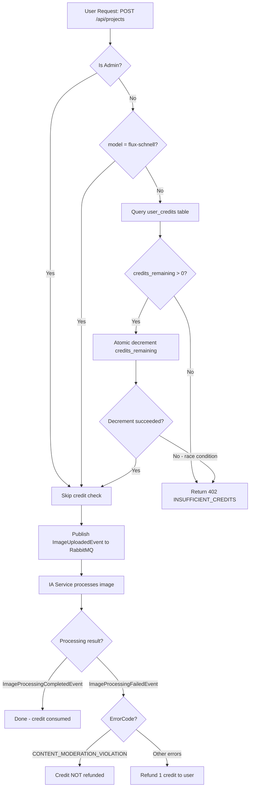

### **Architecture Placement Summary**

| Concern | Service | Layer |
|---------|---------|-------|
| Credit balance storage | Projects Service DB | `user_credits` table |
| Credit check & deduction | Projects Service | Business logic (before RabbitMQ publish) |
| Credit refund on failure | Projects Service | Consumes `ImageProcessingFailedEvent` |
| Subscription tier tracking | Projects Service DB | `user_credits.subscription_tier` |
| Admin bypass | Projects Service | Role check in request handler |
| IA Service | **No awareness of credits** | Pure processing worker |

---

## **System Flows (Mermaid Diagrams)**

### **1. Text-to-Image vs Image-to-Image Flow Comparison**

```mermaid
flowchart TB
    subgraph "Text-to-Image (Budget Tier)"
        A1[User sends prompt] --> B1[Frontend<br/>Angular]
        B1 -->|HTTP /api/projects| C1[Gateway<br/>YARP]
        C1 -->|HTTP| D1[Projects Service<br/>.NET]
        D1 -->|Publish| E1[Image Events Exchange]
        E1 --> F1[IA Service<br/>Python]
        F1 --> G1{Content Check}
        G1 -->|Pass| H1[Pixazo Flux Schnell]
        H1 --> I1[Download generated image]
        I1 --> J1[Cloudinary Upload]
        J1 --> K1[Save to PostgreSQL]
        K1 --> L1[Publish completion]
        G1 -->|Blocked| M1[Return error: CONTENT_MODERATION_VIOLATION]
    end

    subgraph "Image-to-Image (Default/Standard/AI Reasoning)"
        A2[User uploads image + prompt] --> B2[Frontend<br/>Angular]
        B2 -->|HTTP /api/projects| C2[Gateway<br/>YARP]
        C2 -->|HTTP| D2[Projects Service<br/>.NET]
        D2 --> E2[Cloudinary: Store original]
        D2 -->|Publish| F2[Image Events Exchange]
        F2 --> G2[IA Service<br/>Python]
        G2 --> H2{Content Check}
        H2 -->|Pass| I2{Model Selection}
        I2 -->|kontext| J2[Pollinations FLUX.1 Kontext]
        I2 -->|gpt-image-1.5-low| K2[OpenAI GPT1.5 Low]
        I2 -->|nanobanana-low| L2[NanaBanana V1]
        I2 -->|nanobanana-medium| L3[NanaBanana V2]
        I2 -->|nanobanana-max| L4[NanaBanana Pro]
        I2 -->|gpt-image-1.5-medium| M2[OpenAI GPT1.5 Medium]
        J2 & K2 & L2 & L3 & L4 & M2 --> N2[Cloudinary: Store result]
        N2 --> O2[PostgreSQL: Save record]
        O2 --> P2[Publish completion]
        H2 -->|Blocked| Q2[Return error: CONTENT_MODERATION_VIOLATION]
    end
```

---

### **2. IA Service Internal Processing Flow**

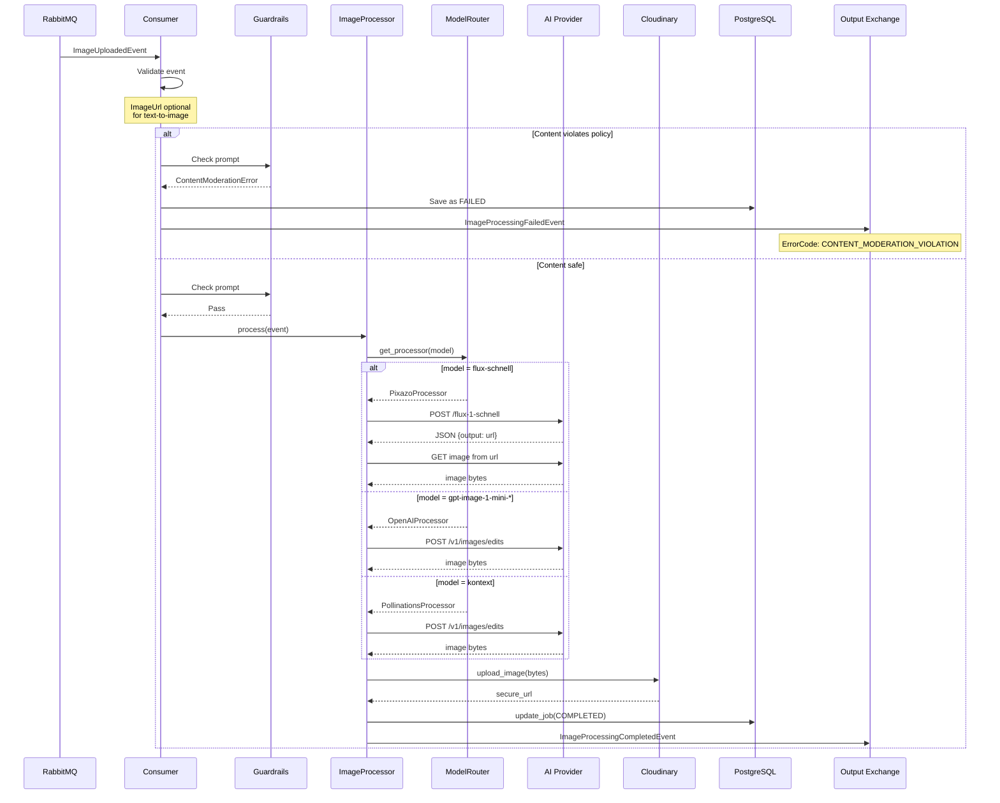

---

### **3. Model Selection Decision Tree**

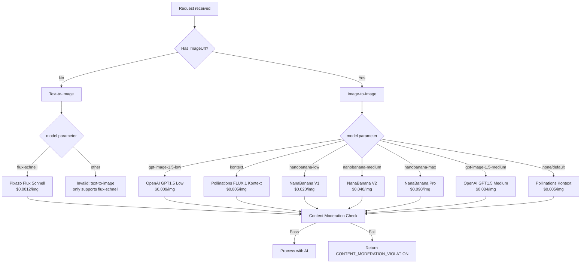

---

### **4. End-to-End Complete Flow**

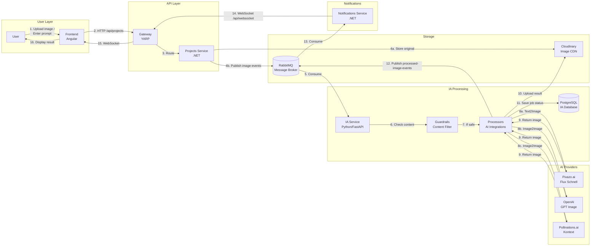

---

### **5. Content Moderation Flow**

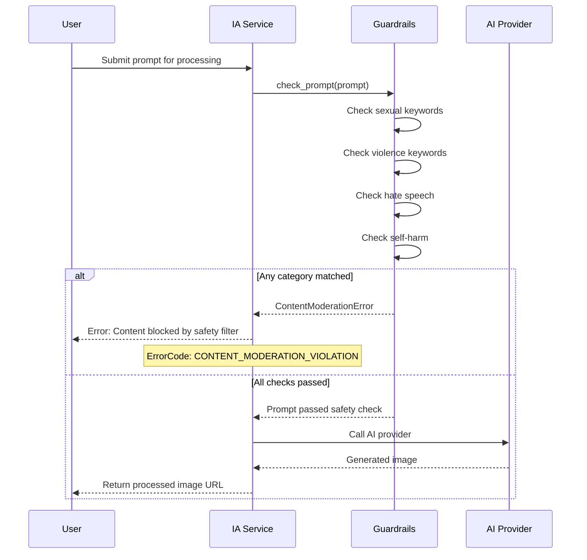

---

### **6. RabbitMQ Message Flow Detail**

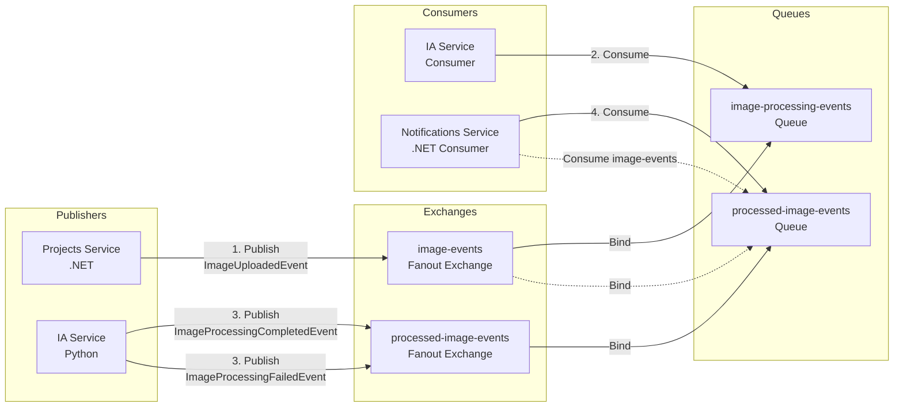

**Message Types:**

| Event | Publisher | Consumer | Key Fields |
|-------|-----------|----------|------------|
| `ImageUploadedEvent` | Projects Service (.NET) | IA Service (Python) | `ImageId`, `OwnerId`, `Prompt`, `ImageUrl` (optional), `Parameters` |
| `ImageProcessingCompletedEvent` | IA Service (Python) | Notifications Service (.NET) | `ImageId`, `ProcessedImageUrl`, `ModelUsed`, `ProcessingTimeMs` |
| `ImageProcessingFailedEvent` | IA Service (Python) | Notifications Service (.NET) | `ImageId`, `ErrorCode`, `ErrorMessage` |

**Error Codes:**
- `CONTENT_MODERATION_VIOLATION` - Prompt blocked by guardrails
- `MODEL_NOT_FOUND` - Requested model not available
- `PROCESSING_ERROR` - AI provider error
- `UPLOAD_ERROR` - Cloudinary upload failed

---

## **C4 Architecture Diagrams**

### **C1: System Context Diagram**

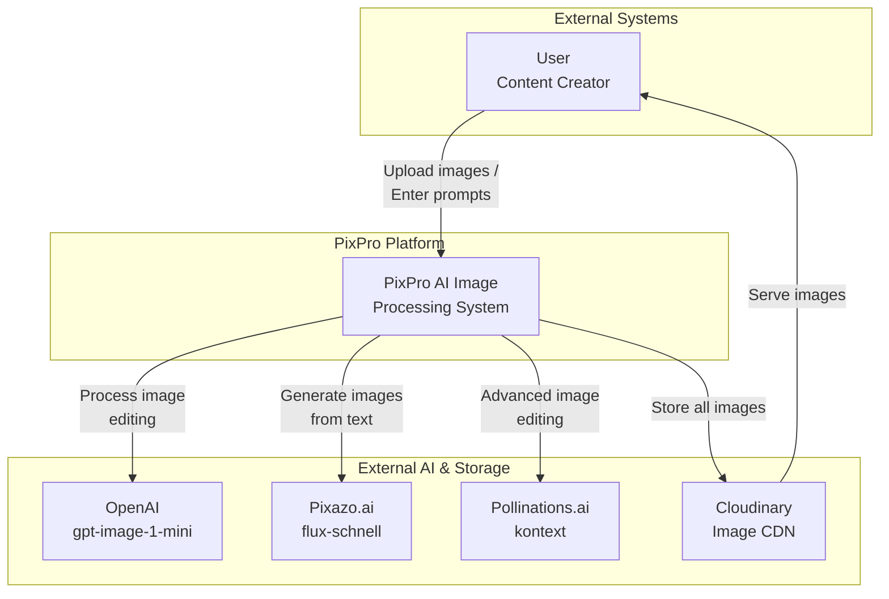

---

### **C2: Container Diagram**

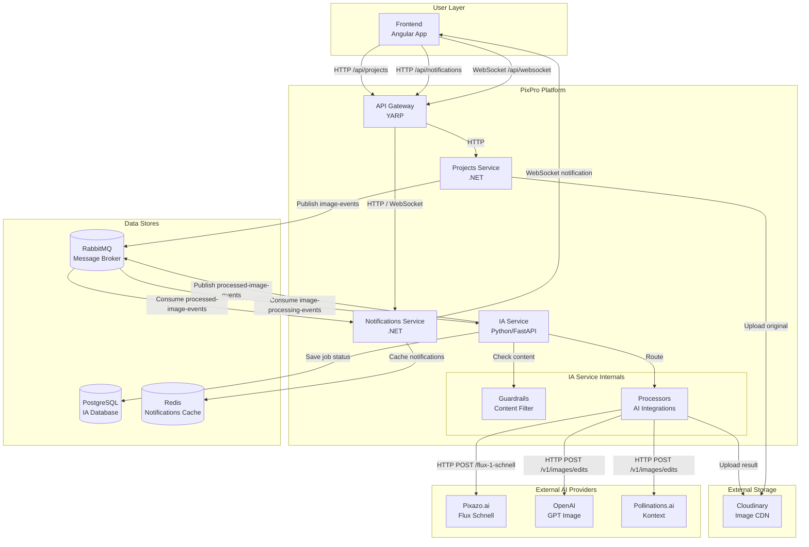

---

### **C3: Component Diagram - IA Service**

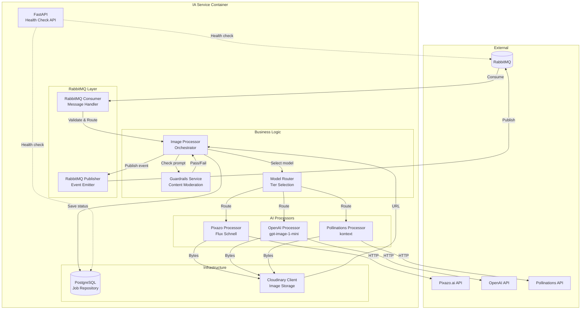

---

### **C4: Code Diagram - Image Processing Flow**

```mermaid
flowchart TD
    subgraph "Entry Point"
        ON_MSG[_on_message<br/>message: bytes]
        PROC_EVT[_process_event<br/>event: ImageUploadedEvent]
    end

    subgraph "Processing Decision"
        CHECK{Guardrails.<br/>check_prompt}
        HAS_IMG{Has<br/>ImageUrl?}
    end

    subgraph "Text-to-Image Path"
        T2I[PixazoProcessor.<br/>process]
        T2I_API[POST /flux-1-schnell]
        T2I_DL[Download from<br/>output URL]
    end

    subgraph "Image-to-Image Path"
        I2I_DL[Download<br/>original image]
        I2I[Processor.<br/>process]
    end

    subgraph "Completion"
        UP[Cloudinary.<br/>upload_image]
        SAVE[Database.<br/>update_job]
        PUB[RabbitMQ.<br/>publish_completed]
    end

    ON_MSG -->|decode & validate| PROC_EVT
    PROC_EVT --> CHECK

    CHECK -->|Fail| ERR[Publish<br/>ImageProcessingFailedEvent]
    CHECK -->|Pass| HAS_IMG

    HAS_IMG -->|No| T2I
    T2I --> T2I_API
    T2I_API -->|JSON {output}| T2I_DL
    T2I_DL --> UP

    HAS_IMG -->|Yes| I2I_DL
    I2I_DL --> I2I
    I2I --> UP

    UP --> SAVE
    SAVE --> PUB
```

---

### **Components Overview**

**PixPro Platform (our system):**

| Component | Technology | Responsibility |
|-----------|------------|----------------|
| **Frontend** | Angular | Web app where users upload images and enter prompts |
| **Gateway** | YARP (Yet Another Reverse Proxy) | Routes HTTP requests and WebSocket connections |
| **Projects Service** | .NET | Handles image uploads, stores to Cloudinary, publishes to RabbitMQ |
| **IA Service** | Python/FastAPI | Consumes events, runs AI processing with guardrails |
| **Guardrails** | Python | Content safety filtering before AI processing |
| **Notifications Service** | .NET | Consumes completion events, sends WebSocket notifications |
| **IA Database** | PostgreSQL | Stores processing job records and status |
| **Notifications Cache** | Redis | Caches notifications for fast retrieval |

**External AI Providers:**
- **Pixazo.ai** - Flux Schnell for text-to-image ($0.0012/img)
- **OpenAI** - GPT Image 1.5 for image editing ($0.009–$0.034/img, low/medium quality)
- **Pollinations.ai** - FLUX.1 Kontext for image editing ($0.005/img)
- **NanaBanana API** - Gemini 2.5 Flash / 3.1 Flash / 3 Pro for image editing ($0.020–$0.090/img)

**Infrastructure:**
- **Cloudinary** - Stores all images (original and generated)
- **RabbitMQ** - Message broker connecting services (Fanout exchanges: `image-events`, `processed-image-events`)

---

## **Processing Parameters**

When sending an image for processing, you can customize the AI behavior with these parameters:

### **Parameter Reference**

| Parameter | Type | Range | Default | Description |
|-----------|------|-------|---------|-------------|
| `width` | int | 64-2048 | 512 | Output image width in pixels |
| `height` | int | 64-2048 | 512 | Output image height in pixels |
| `num_inference_steps` | int | 1-100 | 20 | AI refinement steps (Pixazo uses fixed 4 steps) |
| `strength` | float | 0.0-1.0 | 0.75 | How much AI can change the original image (image-to-image only) |
| `guidance_scale` | float | 1.0-20.0 | 7.5 | How closely AI follows the prompt (Pollinations only) |
| `quantity` | int | 1-10 | 1 | Number of image variations to generate |
| `model` | string | - | `kontext` | AI model to use. Options: `flux-schnell` (txt2img), `kontext`, `gpt-image-1.5-low`, `nanobanana-low`, `nanobanana-medium`, `nanobanana-max`, `gpt-image-1.5-medium` (all img2img) |

### **Usage Examples**

**Text-to-Image (Budget Tier - Cheapest at $0.0012/img):**
```json
{
  "ImageId": "uuid-here",
  "OwnerId": "user-uuid",
  "Prompt": "A majestic dragon flying over a medieval castle at sunset",
  "Parameters": {
    "width": 512,
    "height": 512,
    "quantity": 1,
    "model": "flux-schnell"
  }
}
```
*Note: No `ImageUrl` required for text-to-image generation*

**Image-to-Image subtle edit (Default Tier):**
```json
{
  "ImageId": "uuid-here",
  "OwnerId": "user-uuid",
  "ImageUrl": "https://cloudinary.com/original.jpg",
  "Prompt": "Make this look like a watercolor painting",
  "Parameters": {
    "width": 512,
    "height": 512,
    "strength": 0.3,
    "quantity": 1,
    "model": "gpt-image-1-mini-low"
  }
}
```

**Image-to-Image creative transformation (Standard Tier):**
```json
{
  "ImageId": "uuid-here",
  "OwnerId": "user-uuid",
  "ImageUrl": "https://cloudinary.com/original.jpg",
  "Prompt": "Transform into cyberpunk city at night, neon lights, futuristic",
  "Parameters": {
    "width": 768,
    "height": 512,
    "strength": 0.85,
    "guidance_scale": 12,
    "quantity": 1,
    "model": "kontext"
  }
}
```

**Premium quality edit (AI Reasoning Tier):**
```json
{
  "ImageId": "uuid-here",
  "OwnerId": "user-uuid",
  "ImageUrl": "https://cloudinary.com/original.jpg",
  "Prompt": "Add intricate details, professional photography lighting, 8K quality",
  "Parameters": {
    "width": 1024,
    "height": 1024,
    "strength": 0.5,
    "quantity": 1,
    "model": "gpt-image-1-mini-high"
  }
}
```

**Generate multiple variations:**
```json
{
  "ImageId": "uuid-here",
  "OwnerId": "user-uuid",
  "ImageUrl": "https://cloudinary.com/original.jpg",
  "Prompt": "Portrait with different artistic styles",
  "Parameters": {
    "width": 512,
    "height": 768,
    "quantity": 4,
    "model": "gpt-image-1-mini-low"
  }
}
```

**Content that will be blocked by Guardrails:**
```json
{
  "ImageId": "uuid-here",
  "OwnerId": "user-uuid",
  "Prompt": "Generate a violent scene with blood and weapons",
  "Parameters": {
    "model": "flux-schnell"
  }
}
```
*Result: Error `CONTENT_MODERATION_VIOLATION`*

### **Visual Guide: Strength Parameter**

```
strength=0.2          strength=0.5          strength=0.9
    ↓                    ↓                    ↓
┌──────────┐        ┌──────────┐        ┌──────────┐
│ Original │   →    │  Slight  │   →    │  Heavy   │
│  Photo   │        │ Changes  │        │ Transform│
└──────────┘        └──────────┘        └──────────┘
   20% AI             50% AI              90% AI
   influence         influence          influence
```

### **Model Selection Tips**

| Model | Best For | Task | Cost | Quality |
|-------|----------|------|------|---------|
| `flux-schnell` | Text-to-image generation | **Text → Image** | ⭐⭐⭐⭐⭐ ~$0.0012 | ⭐⭐⭐⭐ |
| `kontext` | Default cheap img2img | Image → Image | ⭐⭐⭐⭐⭐ ~$0.005 | ⭐⭐⭐⭐⭐ |
| `gpt-image-1.5-low` | OpenAI flagship at lowest cost | Image → Image | ⭐⭐⭐⭐ ~$0.009 | ⭐⭐⭐⭐⭐ |
| `nanobanana-low` | Gemini-based editing, entry tier | Image → Image | ⭐⭐⭐ ~$0.020 | ⭐⭐⭐⭐ |
| `nanobanana-medium` | Multi-reference editing, Search grounding | Image → Image | 💰💰 ~$0.040 | ⭐⭐⭐⭐⭐ |
| `nanobanana-max` | Maximum fidelity editing | Image → Image | 💰💰💰 ~$0.090 | ⭐⭐⭐⭐⭐ |
| `gpt-image-1.5-medium` | Best text rendering, OpenAI flagship mid | Image → Image | 💰💰 ~$0.034 | ⭐⭐⭐⭐⭐ |

---

## **Credit System Diagrams**

### **1. Credit System — Request Flow (with all bypass rules)**

Full flow from an HTTP request through credit check, deduction, and the RabbitMQ publish gate.

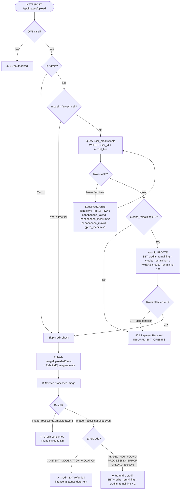

---

### **2. Free Credit Seeding — First-Time User Flow**

Shows when and how free credits are initialized for a new user.

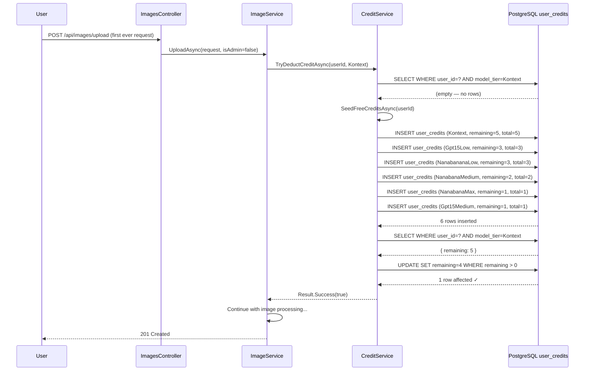

---

### **3. End-to-End Flow with Credit System**

Complete flow from frontend to IA Service, including credit gate and refund path.

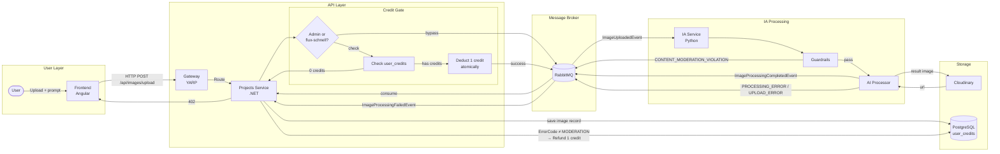

---

### Important note
All file python always should be typed with proper type hints, the code cant allow "any" types usage.
