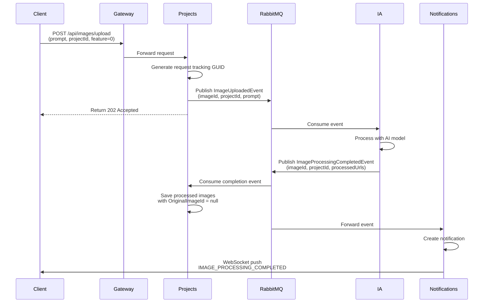
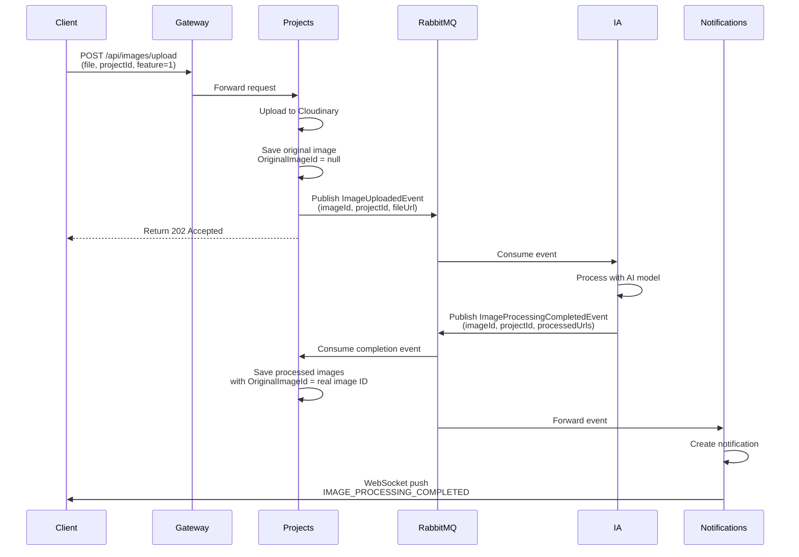

# Image Processing Integration Architecture

## Overview

This document describes the event-driven architecture for integrating processed images from the IA (Image AI) service into the Projects service. The implementation uses RabbitMQ for asynchronous communication between microservices.

## Architecture Components

### Services Involved

| Service | Role | Technology |
|---------|------|------------|
| **Projects** | Publishes upload events, consumes processed events | .NET 9, RabbitMQ.Client |
| **IA** | Processes images, publishes completion events | Python, FastAPI, Pika |
| **Notifications** | Forwards events to WebSocket clients | .NET 9, SignalR |
| **RabbitMQ** | Message broker | RabbitMQ 3.12 |

## Event Flow

### Complete Processing Flow (Feature 0 - Generator)



### Complete Processing Flow (Feature 1 - Editor)



## Event Structure

### ImageUploadedEvent

Published by Projects when an image upload request is received.

```csharp
public record ImageUploadedEvent(
    Guid ImageId,           // Request tracking GUID
    Guid OwnerId,           // User who uploaded
    Guid ProjectId,         // Project to associate images with
    string? ImageUrl,       // Null for generator, Cloudinary URL for editor
    string Prompt,          // Processing prompt
    ProcessingFeature Feature,  // 0=Generator, 1=Editor
    ProcessingParameters? Parameters  // Optional processing params
);
```

### ImageProcessingCompletedEvent

Published by IA when processing is complete.

```csharp
public record ImageProcessingCompletedEvent(
    string ImageId,              // Request tracking ID (from original event)
    string UserId,               // Owner ID
    string ProjectId,            // Project ID
    string? ImageUrl,            // Original image URL (null for generator)
    List<string> ProcessedImageUrls,  // Generated/edited image URLs
    ProcessingResult? ProcessingResults,  // Metadata (model, params, etc.)
    DateTime CompletedAt         // Completion timestamp
);
```

### ImageProcessingFailedEvent

Published by IA when processing fails.

```csharp
public record ImageProcessingFailedEvent(
    string ImageId,
    string UserId,
    string ProjectId,
    string? ImageUrl,
    string ErrorMessage,
    string ErrorCode,
    DateTime FailedAt
);
```

## Database Schema

### Images Table

```sql
CREATE TABLE images (
    id uuid PRIMARY KEY,
    project_id uuid NOT NULL REFERENCES projects(id) ON DELETE CASCADE,
    original_image_id uuid NULL,  -- Reference to original image
    file_name varchar(255) NOT NULL,
    content_type varchar(50) NOT NULL,
    file_path varchar(500) NOT NULL,
    cloudinary_public_id varchar(512) NOT NULL,
    secure_url varchar(1024) NOT NULL,
    format varchar(20) NOT NULL,
    size_in_bytes bigint NOT NULL,
    width integer NOT NULL,
    height integer NOT NULL,
    status varchar(20) DEFAULT 'Pending' NOT NULL,
    owner_id uuid NOT NULL,
    created_at timestamptz NOT NULL
);

-- Indexes
CREATE INDEX idx_images_owner_id ON images(owner_id);
CREATE INDEX idx_images_project_id ON images(project_id);
CREATE INDEX idx_images_original_image_id ON images(original_image_id);
```

### OriginalImageId Semantics

| Value | Meaning | Use Case |
|-------|---------|----------|
| `NULL` | No physical original | AI-generated images (Feature 0) |
| `Guid` | Reference to original | Edited images (Feature 1) |

For **Feature 0 (Generator)**: `OriginalImageId` is `NULL` because there is no physical original image — the image was created purely from a text prompt.

For **Feature 1 (Editor)**: `OriginalImageId` contains the real image ID of the uploaded file that was edited by the AI. This allows tracing back to the source image.

## RabbitMQ Configuration

### Exchanges

| Exchange | Type | Purpose |
|----------|------|---------|
| `image-events` | Fanout | Image upload requests from Projects to IA |
| `processed-image-events` | Fanout | Processing completion from IA to Projects/Notifications |

### Queues

| Queue | Service | Durable | Auto-Delete |
|-------|---------|---------|-------------|
| `ia-processing-queue` | IA | Yes | No |
| `projects-processed-images-queue` | Projects | Yes | No |
| `processed-image-events` | Notifications | Yes | No |

### Queue Bindings

```
image-events (exchange) 
  → ia-processing-queue (IA consumer)

processed-image-events (exchange)
  → projects-processed-images-queue (Projects consumer)
  → processed-image-events (Notifications consumer)
```

## Implementation Details

### Projects Service Consumer

```csharp
public class ProcessedImageEventConsumer : BackgroundService
{
    protected override Task ExecuteAsync(CancellationToken stoppingToken)
    {
        // Declare durable queue
        var queueName = "projects-processed-images-queue";
        _channel.QueueDeclare(queueName, durable: true, exclusive: false, autoDelete: false);
        _channel.QueueBind(queueName, "processed-image-events", routingKey: "");

        var consumer = new EventingBasicConsumer(_channel);
        
        consumer.Received += (model, ea) =>
        {
            var eventData = JsonSerializer.Deserialize<ImageProcessingCompletedEvent>(json);
            
            // Save each processed URL as new Image entity
            foreach (var processedUrl in eventData.ProcessedImageUrls)
            {
                var processedImage = Image.CreateProcessedImage(
                    Guid.Parse(eventData.ImageId),    // Reference to original
                    Guid.Parse(eventData.ProjectId),
                    Guid.Parse(eventData.UserId),
                    processedUrl,
                    "processed");
                    
                await imageRepository.AddAsync(processedImage);
            }
            
            await imageRepository.SaveChangesAsync();
        };
        
        _channel.BasicConsume(queueName, false, consumer);
    }
}
```

### Entity Factory Method

```csharp
public static Image CreateProcessedImage(
    Guid? originalImageId,    // NULL for generator, real ID for editor
    Guid projectId,
    Guid ownerId,
    string secureUrl,        // URL from AI provider (Pollinations, OpenAI)
    string status)
{
    return new Image
    {
        Id = Guid.NewGuid(),
        ProjectId = projectId,
        OriginalImageId = originalImageId,  // NULL = generated, Value = edited
        FileName = $"processed_{Guid.NewGuid():N}.jpg",
        ContentType = "image/jpeg",
        FilePath = secureUrl,
        CloudinaryPublicId = string.Empty,  // Processed images don't use Cloudinary
        SecureUrl = secureUrl,
        Format = "jpg",
        SizeInBytes = 0,  // Unknown for processed images
        Width = 0,
        Height = 0,
        Status = status,
        OwnerId = ownerId,
        CreatedAt = DateTimeOffset.UtcNow
    };
}
```

## WebSocket Notifications

The Notifications service forwards processing events to connected WebSocket clients:

### Notification Types

| Event Type | Description | Payload |
|------------|-------------|---------|
| `IMAGE_UPLOADED` | Image uploaded successfully | `{ imageId, projectId }` |
| `IMAGE_PROCESSING_COMPLETED` | Processing finished | `{ imageId, processedUrls[], projectId }` |
| `IMAGE_PROCESSING_FAILED` | Processing error | `{ imageId, errorMessage, errorCode }` |

### WebSocket Message Format

```json
{
  "type": "IMAGE_PROCESSING_COMPLETED",
  "notification": {
    "id": "notif-uuid",
    "userId": "user-uuid",
    "title": "Image Processing Completed",
    "message": "Your image has been processed successfully!",
    "metadata": {
      "eventType": "ImageProcessingCompleted",
      "imageId": "img-uuid",
      "projectId": "proj-uuid",
      "processedImageUrls": ["url1", "url2"]
    }
  },
  "timestamp": "2026-05-31T10:30:00Z"
}
```

## Error Handling

### Consumer Error Handling

```csharp
consumer.Received += (model, ea) =>
{
    try
    {
        // Process message
        _channel?.BasicAck(ea.DeliveryTag, false);
    }
    catch (Exception ex)
    {
        _logger.LogError(ex, "Error processing message");
        _channel?.BasicNack(ea.DeliveryTag, false, false); // Reject, don't requeue
    }
};
```

### Dead Letter Queue (Optional)

For production, configure a DLQ for failed messages:

```csharp
_channel.QueueDeclare("projects-processed-images-dlq", durable: true);
_channel.BasicNack(ea.DeliveryTag, false, false); // Dead letter
```

## Testing

### Manual Test Flow

1. **Upload with Generator (Feature 0)**:
   ```bash
   curl -X POST http://localhost:8080/api/images/upload \
     -H "Authorization: Bearer $TOKEN" \
     -H "Content-Type: application/json" \
     -d '{
       "projectId": "your-project-uuid",
       "prompt": "a cat with a microphone singing",
       "feature": 0
     }'
   ```

2. **Upload with Editor (Feature 1)**:
   ```bash
   curl -X POST http://localhost:8080/api/images/upload \
     -H "Authorization: Bearer $TOKEN" \
     -F "file=@your-image.jpg" \
     -F "projectId=your-project-uuid" \
     -F "prompt=make this cyberpunk style" \
     -F "feature=1"
   ```

3. **Verify in Database**:
   ```sql
   -- Original images
   SELECT * FROM images 
   WHERE project_id = 'your-project-uuid' 
     AND original_image_id IS NULL;

   -- Processed images
   SELECT * FROM images 
   WHERE project_id = 'your-project-uuid' 
     AND original_image_id IS NOT NULL;
   ```

## Monitoring

### Key Metrics

| Metric | Description | Alert Threshold |
|--------|-------------|-----------------|
| `processed_image_events_consumed` | Events consumed by Projects | < 1/min |
| `processed_image_save_failures` | Database save errors | > 0 |
| `websocket_notifications_sent` | Real-time notifications | Track volume |
| `rabbitmq_queue_depth` | Pending messages | > 1000 |

### Health Checks

- **Projects Consumer**: Check queue connection
- **IA Service**: Check processing queue depth
- **Notifications**: Check WebSocket connections

## Future Enhancements

1. **Batch Processing**: Support multiple images in single event
2. **Retry Logic**: Implement exponential backoff for failed saves
3. **Analytics**: Track processing time by model/provider
4. **Image Metadata**: Store AI parameters (seed, model version, etc.)
5. **Thumbnail Generation**: Auto-generate thumbnails for processed images
